#  Agentic AI Resume Analyzer

An Agentic AI application built with **CrewAI** and **Streamlit** that analyzes resumes using autonomous AI agents and provides career insights and job-specific resume evaluation.

The project has evolved through two versions, with **Version 2** extending the original resume analysis system with job-description analysis and resume-to-job comparison.

---

#  Project Versions

## 🔹 Version 1 — Resume Analyzer & Career Advisor

### Overview

Version 1 focuses on analyzing a candidate's resume and providing personalized career guidance.

The system uses multiple autonomous agents to analyze the uploaded resume and generate useful career recommendations.

### Features

* 📄 Upload a resume
* 🔍 Extract resume information
* 🧠 Analyze candidate skills and experience
* 🎓 Identify education and projects
* 💼 Infer suitable job roles
* 📊 Identify strengths and skill gaps
* 🎯 Provide resume improvement recommendations
* 🛣️ Generate a personalized career/learning roadmap
* 🌐 Use web search for role-specific career insights

### Agents

**Resume Analyzer Agent**

Responsible for analyzing the resume and extracting:

* Skills
* Experience
* Education
* Projects
* Certifications
* Potential target roles
* Resume strengths and gaps

**Career Advisor Agent**

Uses the resume analysis to provide:

* Career recommendations
* Missing skills
* Resume improvement suggestions
* Recommended certifications
* Learning roadmap
* Role-specific guidance

### Version 1 Workflow

```text
                 Resume PDF
                     │
                     ▼
              PDF Resume Parser
                     │
                     ▼
            Resume Analyzer Agent
                     │
                     ▼
              Resume Analysis
                     │
                     ▼
             Career Advisor Agent
                     │
                     ▼
          Career Recommendations
                     │
                     ▼
              Streamlit UI
```

### Version 1 Technology Stack

* Python
* CrewAI
* Streamlit
* OpenRouter API
* Serper API
* PDFPlumber
* Pydantic
* python-dotenv

---

# 🔹 Version 2 — AI Resume & Job Matcher

### Overview

Version 2 extends Version 1 by introducing **job-description analysis and resume-to-job comparison**.

Instead of only analyzing the candidate's resume, the system can now compare the resume against a specific job description and identify how well the candidate matches the role.

### New Features

* 📄 Resume analysis
* 💼 Job description input
* 🔍 Job description analysis
* 🔗 Resume-to-job comparison
* 📊 Overall match percentage
* ✅ Matching skills and keywords
* ⚠️ Partial/related skill matches
* ❌ Missing skills and keywords
* 📈 Key skill gaps
* 📝 Job-specific resume improvement recommendations
* 🎯 Overall suitability assessment

### New Agents

**Job Description Analyzer Agent**

Analyzes the provided job description and identifies:

* Required skills
* Preferred skills
* Experience requirements
* Technical requirements
* Domain requirements
* Responsibilities
* Keywords

**Keyword Gap Analyzer Agent**

Compares the resume with the analyzed job description and identifies:

* Matching keywords
* Partial matches
* Missing keywords
* Missing technical skills
* Experience gaps
* Domain-specific gaps

### Version 2 Workflow

```text
                 Resume PDF
                     │
                     ▼
              PDF Resume Parser
                     │
                     ▼
            Resume Analyzer Agent
                     │
                     │
                     ├─────────────────────┐
                     │                     │
                     ▼                     ▼
              Resume Analysis       Job Description
                                           │
                                           ▼
                               Job Description Analyzer
                                           │
                                           ▼
                                  Job Requirements
                                           │
                     ┌─────────────────────┘
                     │
                     ▼
            Keyword Gap Analyzer
                     │
                     ▼
             Resume ↔ Job Comparison
                     │
                     ▼
                Match Report
                     │
                     ▼
                Streamlit UI
```

---

#  Version 1 vs Version 2

| Feature                  | Version 1 | Version 2    |
| ------------------------ | --------- | ------------ |
| Resume Upload            | ✅         | ✅            |
| Resume Parsing           | ✅         | ✅            |
| Skill Extraction         | ✅         | ✅            |
| Experience Analysis      | ✅         | ✅            |
| Education Analysis       | ✅         | ✅            |
| Project Analysis         | ✅         | ✅            |
| Role Inference           | ✅         | ✅            |
| Career Recommendations   | ✅         | ✅            |
| Learning Roadmap         | ✅         | ✅            |
| Job Description Input    | ❌         | ✅            |
| Job Description Analysis | ❌         | ✅            |
| Resume-to-Job Matching   | ❌         | ✅            |
| Matching Keywords        | ❌         | ✅            |
| Missing Keywords         | ❌         | ✅            |
| Skill Gap Analysis       | Basic     | Job-specific |
| ATS/Alignment Insights   | Basic     | Job-specific |
| Resume Recommendations   | General   | Job-specific |

---

#  Architecture

```text
                         Streamlit
                            │
             ┌──────────────┴──────────────┐
             │                             │
        Resume Analysis             Job Comparison
             │                             │
             ▼                             ▼
      Resume Analyzer            Job Description Analyzer
             │                             │
             └──────────────┬──────────────┘
                            ▼
                   Keyword Gap Analyzer
                            │
                            ▼
                       CrewAI Crew
                            │
                            ▼
                    OpenRouter LLM
                            │
                            ▼
                     Final Analysis
```

---

#  Tech Stack

### AI / Agent Framework

* CrewAI
* OpenRouter
* LLM-based autonomous agents

### Backend / Processing

* Python
* PDFPlumber
* Pydantic

### Web Application

* Streamlit

### External Services

* OpenRouter API
* Serper API

### Development

* Git
* GitHub
* VS Code

---

#  Project Structure

```text
resume_analyzer_agent/
│
├── app.py
├── README.md
├── requirements.txt
├── .env
│
├── config/
│   ├── agents.yaml
│   └── tasks.yaml
│
├── src/
│   └── resume_analyzer_agent/
│       ├── __init__.py
│       ├── main.py
│       ├── crew.py
│       │
│       └── tools/
│           └── pdf_parser.py
│
├── resumes/
│
└── tests/
```

---

#  Installation

### 1. Clone the repository

```bash
git clone https://github.com/Siyad19/agentic-resume-analyzer.git

cd agentic-resume-analyzer
```

### 2. Create a virtual environment

```bash
python -m venv venv
```

Activate it on Windows:

```bash
venv\Scripts\activate
```

### 3. Install dependencies

```bash
pip install -r requirements.txt
```

### 4. Configure environment variables

Create a `.env` file:

```env
OPENROUTER_API_KEY=your_openrouter_api_key
SERPER_API_KEY=your_serper_api_key
```

### 5. Run the application

```bash
streamlit run app.py
```

---

#  Example Version 2 Output

The job comparison produces insights such as:

```text
Overall Match: 85%

Matching Skills:
- Python
- Machine Learning
- Deep Learning
- NLP
- Generative AI
- CrewAI
- LangChain
- Docker
- GitHub

Partial Matches:
- Cloud platforms
- Data Engineering
- AI deployment

Missing Skills:
- Kubernetes
- PyTorch
- AWS
- Azure
- Reinforcement Learning

Key Skill Gaps:
- Limited cloud experience
- Limited large-scale deployment experience
- Missing Kubernetes experience

Resume Recommendations:
- Highlight cloud projects
- Quantify project achievements
- Add relevant deployment experience
```

---

# Future Improvements

* 📊 Interactive ATS score visualization
* 📑 Resume improvement generator
* 📄 Automatically generate an optimized resume
* 🔎 Support multiple job descriptions

---

# Preview

### Version-1
---
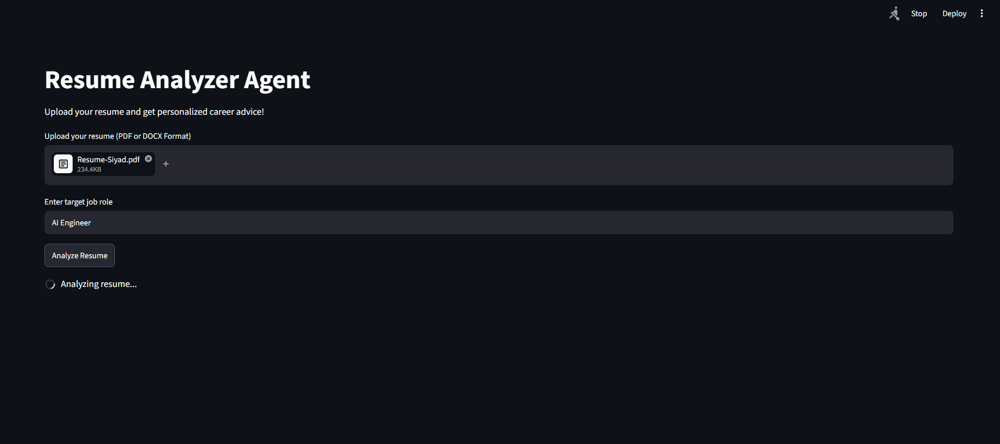
---
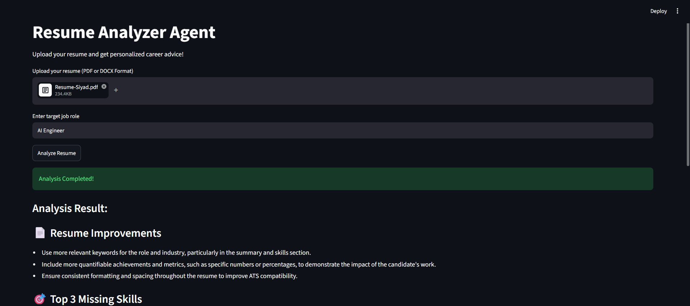
---
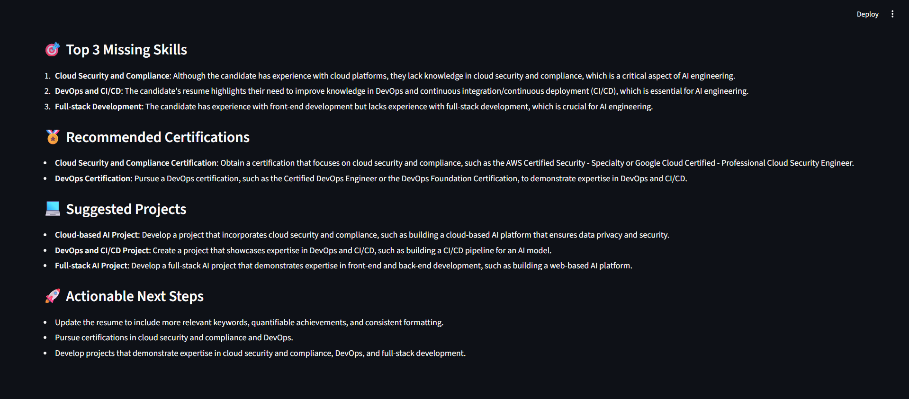
---

### Version-2
---
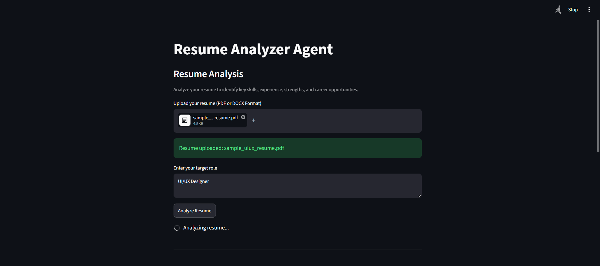
---
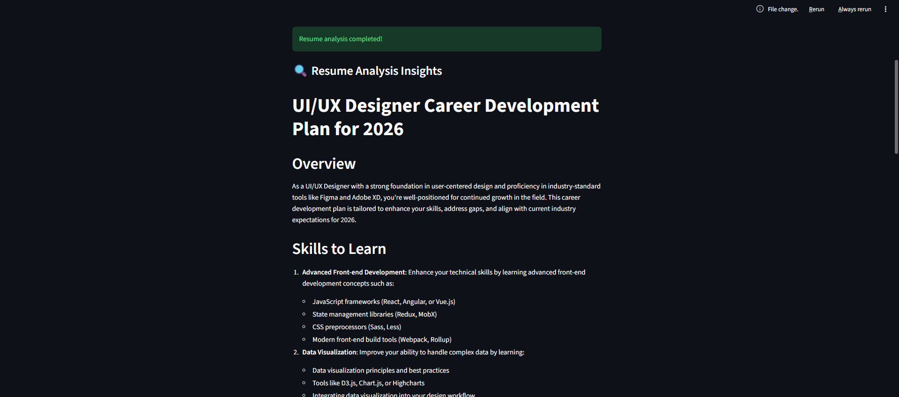
---
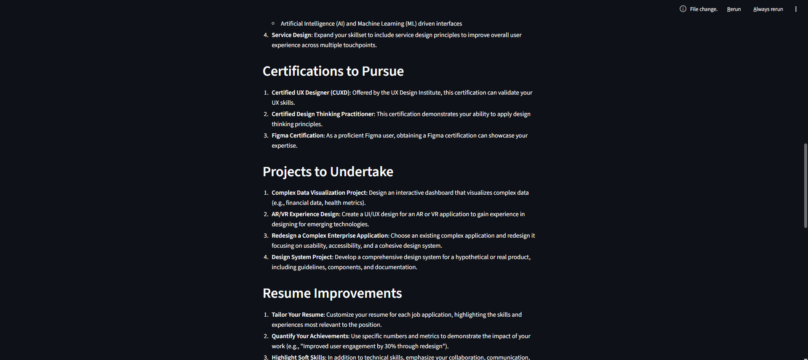
---
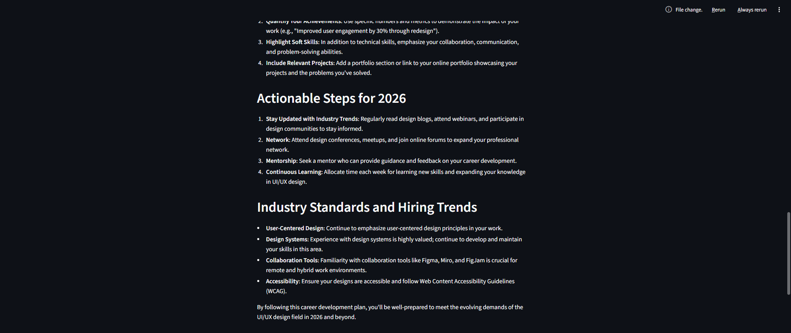
---
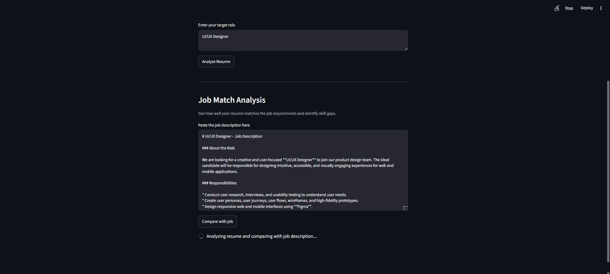
---
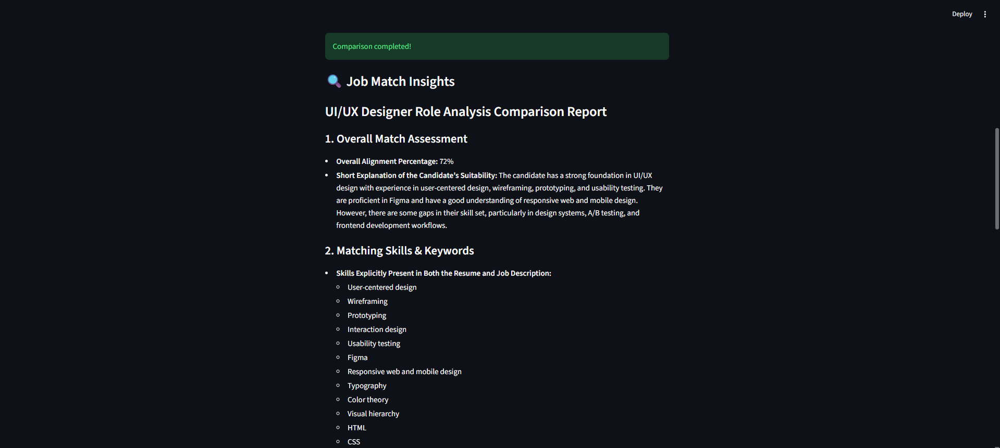
---
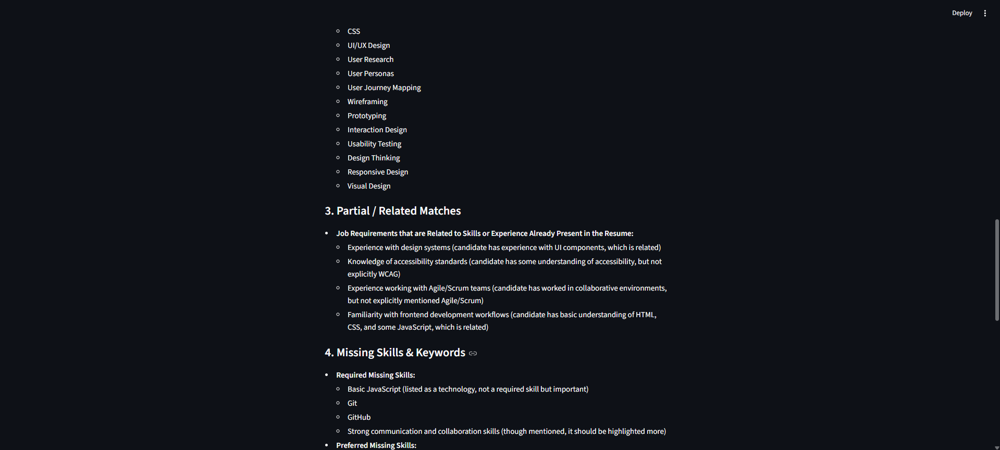
---
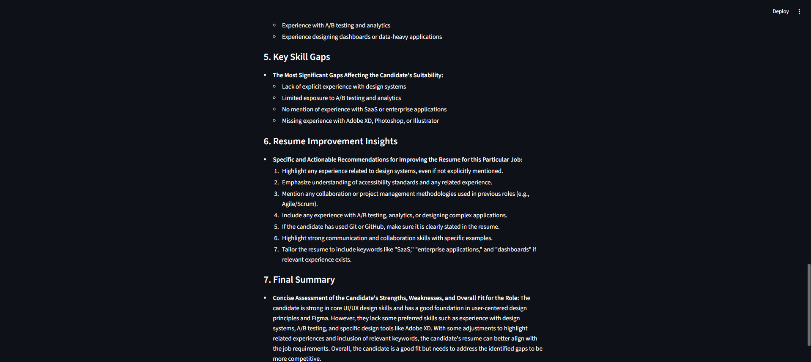
---
